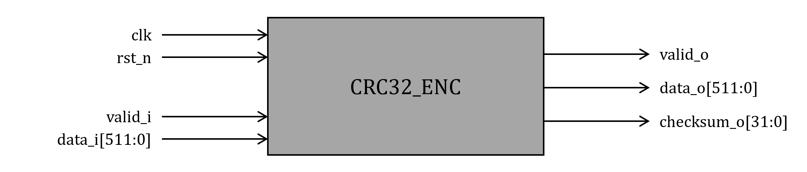

# Overview

This project provides
+ SystemVerilog code for the synthesis of a CRC32 encoder and decoder, along with
+ C-based simulation to evaluate the error detection performance of the CRC32 code.

# 1. CRC32 Encoder & Decoder Synthesis (SystemVerilog)

This repository contains SystemVerilog RTL for synthesizing the CRC32 encoder and decoder logic.

We provide two approaches for implementing CRC32:

+ **General**: Uses the basic division method.
+ **Table-based**: Utilizes precomputed CRC32 values.

Both methods allow synthesis using any desired CRC32 polynomial.

Refer to [this link](https://crccalc.com/?crc=123456789&method=CRC-32&datatype=0&outtype=0) for possible CRC32 codes.

## If you want to use the **General** method

### Before you start

Set your desired polynomial value in `sverilog/general/DEC/rtl/CRC32_GEN.sv` and `sverilog/general/ENC/rtl/CRC32_GEN.sv`:

```
`define     GEN_POLY                    //YOUR_CODE_HERE//
`define     INIT_VAL                    //YOUR_CODE_HERE//
`define     XOR_OUT                     //YOUR_CODE_HERE//
```

### Synthesizing Decoder

```
% cd sverilog/general/DEC
% dc_shell-xg-t -f script.tcl
```

### Synthesizing Encoder

```
% cd sverilog/general/ENC
% dc_shell-xg-t -f script.tcl
```

## If you want to use the **Table-based** method

### Before you start

You need to generate a pre-calculated CRC32 table using `sverilog/table-based/python/gen_table.py`.

Set your desired polynomial value in `gen_table.py`:

```
CRC_POLY   = //YOUR_CODE_HERE//
```

Run `gen_table.py` to get the table:

```
% cd sverilog/table-based/python
% python gen_table.py
```

Copy and paste the result from `gen_table.py` into `sverilog/table-based/DEC-table/rtl/CRC32_DEC.sv` and `sverilog/table-based/ENC-table/rtl/CRC32_ENC.sv`:

```
localparam [DATA_WIDTH-1:0] CRC_COEFF_TABLE[CRC_WIDTH-1:0] = '{ //YOUR_TABLE_HERE// }
```

### Synthesizing Decoder

```
% cd sverilog/table-based/DEC-table
% dc_shell-xg-t -f script.tcl
```

### Synthesizing Encoder

```
% cd sverilog/table-based/ENC-table
% dc_shell-xg-t -f script.tcl
```

## Port List

Below are the port specifications for the CRC32 encoder and decoder modules.

### Encoder

| Port           | Direction | Width    | Description                               |
| :---           | :---      | :---     | :---                                      |
| clk            | Input     | 1        | Clock                                     |
| rst_n          | Input     | 1        | Reset (active low) synchronizd to the clk |
| valid_i        | Input     | 1        | Valid signal for data_i                   |
| data_i         | Input     | 512      | Input data                                |
| valid_o        | Output    | 1        | Valid signal for data_o, checksum_o       |
| data_o         | Output    | 512      | Output data (same as data_i)              |
| checksum_o     | Output    | 32       | Calculated checksum for input data        |

### Decoder

| Port           | Direction | Width    | Description                               |
| :---           | :---      | :---     | :---                                      |
| clk            | Input     | 1        | Clock                                     |
| rst_n          | Input     | 1        | Reset (active low) synchronizd to the clk |
| valid_i        | Input     | 1        | Valid signal for data_i, checksum_i       |
| data_i         | Input     | 512      | Input data                                |
| checksum_i     | Input     | 32       | Input checksum                            |
| valid_o        | Output    | 1        | Valid signal for data_o, detected_o       |
| data_o         | Output    | 512      | Output data (same as data_i)              |
| detected_o     | Output    | 32       | Error detection signal ('1' if detected)  |      

## Block Diagram of Encoder & Decocder

### Encoder



### Decoder


# 2. Error Detection Performance Simulation (C)

We provide simple C code to evaluate the error detection capabilities of the CRC32 code.

There are two different modes, each for a different purpose:

+ **Simulation mode**: Evaluates the error detection capabilities of the given CRC32 code using Monte Carlo simulation.
  + You can change the number of iterations by setting `NUM_ITER` in `crc32.h`.
+ **Encoding mode**: Computes the CRC32 checksum for the given data.
  + You can verify the result of the SystemVerilog code by comparing it with the result from this mode.

## Before you start

Set your desired polynomial value in `crc32.h`:

```
#define GEN_POLY //YOUR_CODE_HERE//
#define INIT_VAL //YOUR_CODE_HERE//
#define XOR_VAL  //YOUR_CODE_HERE//
```

To use the **Encoding mode**, a `data.txt` file containing the input data must be present in the `c/src/` directory.

`data.txt` example:

```
0x12345678 0x9ABCDEF0 0x13579BDF 0x2468ACE0 0x1A2B3C4D 0x5E6F7A8B 0xFFFFFFFF 0x00000000
0x89ABCDEF 0x01234567 0x89ABCDEF 0xFEDCBA98 0x13579BDF 0x02468ACE 0xFACEB00C 0xFEEDFACE
```

## Running the Simulation

Build:

```
% cd c/src
% make
```

Running in Simulation mode:

```
% cd ../bin
% ./crc32 sim
```

Or Running in Encoding mode:

```
% cd ../bin
% ./crc32 enc
```

## Example Output

Simulation mode:

```
% ./crc32 sim
##### Result #####
Total detected error       : 10000000 / 10000000 (100.00%)
Odd error                  : 5000082 / 5000082 (100.00%)
Burst error (length <= 32) : 10000000 / 10000000 (100.00%)
```

+ Note that all burst errors must be detected.

Encoding mode:

```
% ./crc32 enc
[Data] : 121A8913_9A5E0102_13FF89FA_2400FEFE_342BAB57_BC6F2346_57FFABCE_6800DCED_563CCD9B_DE7A458A_9BFFCDB0_AC00BAFA_784DEFDF_F08B67CE_DFFFEF0C_E00098CE
[Checksum] : 575A8EF2
```
